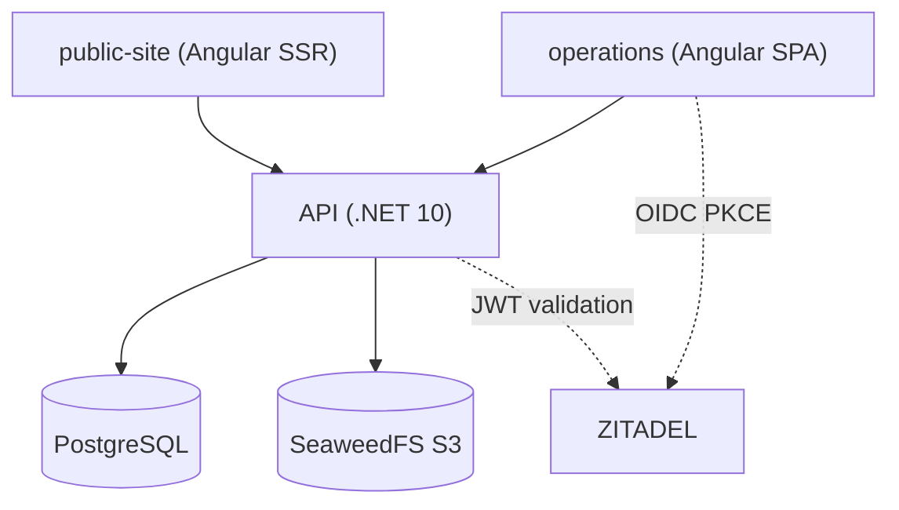

# Architecture Overview

## Backend Modules

| Module | Responsibility |
| --- | --- |
| Platform kernel | Tenants, domains, memberships, capability registry, auditing |
| Operations core | Customers, work requests, work orders, timeline, attachments, service catalog |
| Optional modules | Assets, parts/inventory, procedures, field dispatch, recurring maintenance, SLA |
| Templates | Versioned vertical defaults and tenant overrides |
| Commercial | Plans, subscriptions, entitlements |

Target projects, not yet created: `Domain`, `Application`, `Infrastructure`, `Api`, `UnitTests`, `E2ETests` under `src/`. See [the backend foundation analysis](backend-foundation.md).

## Effective Access

A capability is available only when all three hold:

1. The tenant's template enables the module.
2. The tenant's subscription entitles it.
3. The actor's role authorizes it.

The API enforces this; the frontend only reflects it.

## Tenant Configuration Boundary

Templates may configure vocabulary, navigation order, catalogs, forms, theme tokens, header/footer content, and module-defined workflow options. New entities, invariants, permissions, integrations, or side effects require a typed module.
