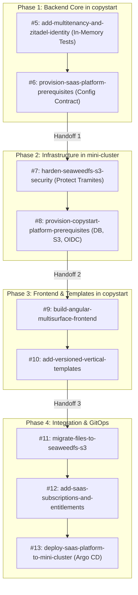

# Master Execution Runbook — CopyStart SaaS Delivery

Last updated: 2026-10-01.
Governing change: `orchestrate-roadmap-delivery`.
Delivery roadmap: [roadmap.md](roadmap.md).

---

## 1. Overview & Operational Model

This runbook is the single authoritative operational guide for executing the 13-stage CopyStart SaaS delivery roadmap without cross-repository stalls or dependency deadlocks.

### The Decoupling Invariant
> **RULE:** Application code slices in `copystart` (Phase 1) MUST NOT block on physical cluster or live service availability.
> - OIDC and JWT authorization MUST be verified using `TestAuthenticationHandler`, mocked claims principals, and `WebApplicationFactory`.
> - Database tenancy and query filters MUST be verified using transaction-local database testing or isolated SQLite/PostgreSQL test containers.
> - Missing external resources must trigger clean fail-closed health check assertions without throwing unhandled exceptions.

---

## 2. Infrastructure Blast-Radius Guardrails (Protecting Other Tenants)

The mini-cluster hosts active workloads, notably `GovCo.Tramites` (`tramites_dev_db`, S3 storage, OpenBao Transit engines, and ZITADEL identities) and `Ecclesiae`. All operations targeting `mini-cluster` MUST enforce the following boundaries:

| Resource Area | Existing Workloads (`Tramites` / Clúster) | CopyStart Isolation Boundary | Prohibited Actions |
| :--- | :--- | :--- | :--- |
| **PostgreSQL** | `tramites_dev_db`, `tramites_prod_db`, roles `tramites_*` | Database: `copystart_dev_db` Role: `copystart_dev_user` | **PROHIBITED:** Any query, grant, alter, or drop statement referencing `tramites_*` databases or roles. |
| **SeaweedFS S3** | Bucket `tramites-app`, active upload credentials | Bucket: `copystart-dev-files` Identity: `copystart-app` | **PROHIBITED:** Deleting or overwriting existing S3 credentials in OpenBao. Hardening in Gate 7 MUST preserve `tramites-app` before disabling anonymous read. |
| **ZITADEL** | Organization and Project: Tramites | Organization: `copystart` Project: `CopyStart Platform` | **PROHIBITED:** Modifying Tramites users, roles, or organization settings. CopyStart uses its own Project Grant. |
| **OpenBao (Vault)** | Path `secret/data/tramites/*` and Transit payment engine | Path: `secret/data/copystart/dev/*` | **PROHIBITED:** Touching `secret/data/tramites/*` or shared Transit keys. |
| **K3s / Ingress** | Namespaces: `tramites`, `traefik`, `storage` | Namespace: `copystart-dev` Host header: `copystart.local` | **PROHIBITED:** Modifying IngressRoute rules of other services. Traefik routes exclusively by exact Host header. |

---

## 3. Four-Phase Execution Pipeline

### Phase 1: CopyStart Backend Core (Repo: `copystart`)

#### Gate 5: `add-multitenancy-and-zitadel-identity`
- **Scope**: Multi-tenant database schema (`ITenantOwned`), EF Core global filters, RLS policies, transaction-local tenant context, and OIDC middleware.
- **Verification Strategy**:
  - Task 2.1 is decoupled: test with `TestAuthenticationHandler` in `src/CopyStart.Api/Authentication/TestAuthenticationHandler.cs`.
  - Validate tenant isolation in `TenantDatabaseIsolationTests.cs` and `TenantOwnershipTests.cs`.
  - Pass all tests: `DOTNET_CLI_HOME=/tmp dotnet test`.
  - Validate strictly: `openspec validate add-multitenancy-and-zitadel-identity --strict`.
- **Exit Criteria**: All 14 tasks in `tasks.md` marked complete `[x]`, commit focused changes, and archive change.

#### Gate 6: `provision-saas-platform-prerequisites`
- **Scope**: Define strongly typed configuration classes in `CopyStart.Infrastructure/Options/` (`PostgreSqlOptions`, `StorageOptions`, `ZitadelOptions`).
- **Verification Strategy**:
  - Prove that missing or invalid settings fail closed with informative errors that redact secrets.
  - Implement and verify `FrozenPersistenceReadinessHealthCheck`.
  - Validate strictly: `openspec validate provision-saas-platform-prerequisites --strict`.
- **Exit Criteria**: Change archived in `copystart`. Handoff to `mini-cluster`.

---

### Phase 2: Mini-Cluster Infrastructure Prerequisites (Repo: `mini-cluster`)

#### Handoff 1: Switch working directory to `/Volumes/MAC/Repo/Personal/mini-cluster`.

#### Gate 7: `harden-seaweedfs-s3-security`
- **Preflight**: Verify Tailscale connectivity (`tailscale status` / `nc -zv 100.67.252.11 30432`) and unsealed OpenBao.
- **Scope**: Remove global anonymous read from SeaweedFS S3, preserve `tramites-app` identity, generate S3 credentials via ESO.
- **Verification Strategy**:
  - Run `bash scripts/tests/bootstrap-full-cluster.test.sh`.
  - Prove that anonymous read is denied and authenticated `tramites-app` read/write succeeds.
  - Validate strictly: `openspec validate harden-seaweedfs-s3-security --strict`.
- **Exit Criteria**: Change archived in `mini-cluster`.

#### Gate 8: `provision-copystart-platform-prerequisites`
- **Scope**: Idempotently create `copystart_dev_db`, `copystart_dev_user`, private bucket `copystart-dev-files`, and ZITADEL Org `copystart`.
- **Verification Strategy**:
  - Execute database and storage setup scripts with `--check-only` first.
  - Verify secret delivery via ExternalSecrets (ESO) to OpenBao path `secret/data/copystart/dev/*`.
  - Run `scripts/bootstrap-full-cluster.sh --profile verify --check-only`.
  - Validate strictly: `openspec validate provision-copystart-platform-prerequisites --strict`.
- **Exit Criteria**: Change archived in `mini-cluster`. Handoff back to `copystart`.

---

### Phase 3: CopyStart Multisurface Frontend & Templates (Repo: `copystart`)

#### Handoff 2: Switch working directory to `/Volumes/MAC/Repo/Personal/copystart`.

#### Gate 9: `build-angular-multisurface-frontend`
- **Scope**: Scaffold Angular 22 workspace with `public-site` (SSR/SSG) and `operations` (client-rendered SPA with Signals).
- **Verification Strategy**:
  - Verify tenant-correct SSR HTML before hydration.
  - Pass compressed bundle budgets and WCAG 2.2 AA accessibility checks.
  - Validate strictly: `openspec validate build-angular-multisurface-frontend --strict`.

#### Gate 10: `add-versioned-vertical-templates`
- **Scope**: Implement immutable versioned vertical templates (Copier service vs. Automotive workshop).
- **Verification Strategy**:
  - Test tenant overrides, catalog seeding, and field locking without code changes.
  - Validate strictly: `openspec validate add-versioned-vertical-templates --strict`.

---

### Phase 4: Integration, Entitlements & GitOps Deployment (Both Repos)

#### Gate 11: `migrate-files-to-seaweedfs-s3` (Repo: `copystart`)
- **Scope**: Presigned URL generation for SeaweedFS S3, upload validation lifecycle, and cross-tenant access denial.

#### Gate 12: `add-saas-subscriptions-and-entitlements` (Repo: `copystart`)
- **Scope**: Plan catalog, subscription state machine, and capability registry enforcement.

#### Gate 13: `deploy-saas-platform-to-mini-cluster` (Repo: `copystart` + `mini-cluster`)
- **Scope**: Publish container images by immutable digest to GHCR, create Kustomize overlays in `gitops/overlays/dev`, register Argo CD application in `mini-cluster`, and verify Traefik ingress routing.
- **Rollback**: Scoped Git revert of the GitOps overlay commit; Argo CD reconciles the cluster back to the previous stable digest.

---

## 4. Tenant Isolation and Cross-Tenant Denial Checklist

Whenever writing or auditing tenant-aware code, verify each of the following:

- [ ] **Ambient Context Derivation**: Authenticated tenant context MUST come only from validated claims (`tenant_id` or `org_id` in JWT). Never accept client-supplied tenant query parameters or body fields.
- [ ] **Exact Host Mapping for Anonymous Requests**: Anonymous requests (e.g. public landing page) MUST resolve tenant strictly by exact `Host` header match against registered tenant domains. Unregistered hosts fail closed.
- [ ] **Database Filter Enforcement**: All queries on entities implementing `ITenantOwned` MUST have EF Core global query filters (`Where(e => e.TenantId == currentTenantId)`).
- [ ] **Cross-Tenant Anti-IDOR**: Querying an existing resource ID belonging to Tenant B while authenticated as Tenant A MUST return `404 Not Found`, never `403 Forbidden` (preventing resource existence enumeration).
- [ ] **Pooled Connection Safety**: In PostgreSQL / EF Core connection pooling, ambient session state (e.g. `SET LOCAL app.current_tenant_id`) MUST be cleared or reset before returning the connection to the pool.
- [ ] **Zero Secrets in Logs**: Never log JWT tokens, database connection passwords, presigned URL signature components, or customer credentials.
